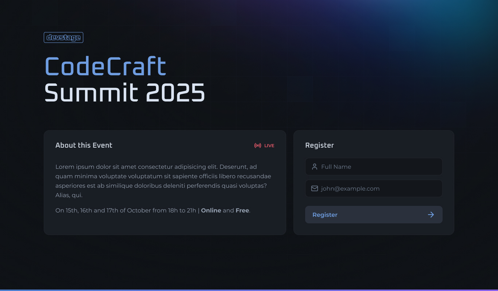

    <h1 align="center">🎉 NLWConnect: CodeCraftSummit 2025</h1>

## 📝 About:
NLWConnect: CodeCraftSummit 2025 is a full-stack Invite Event Indication project built using `React`, `Next.js`, `Fastify`, `RESTful API`, `SQL`, `Swagger`, and data validation.

This project was developed during NLWConnect, a free event held from February 17th to 20th, 2025, organized by Rocketseat. The event brought together thousands of developers worldwide to learn, share knowledge, and network with like-minded professionals.

  

## © Copyright:
Please note, this is a simple project as a IT student, however, it may contain some part of the code that may be Copyright. Please also note that this project is `non-profit` and not intended to be monetized.

<strong>Thanks to [RocketSeat](https://www.rocketseat.com.br).</strong>

---

<strong>Built with 💙 by [@Marcos Oliveira](https://www.linkedin.com/in/pgmarcosoliveira/)</strong>